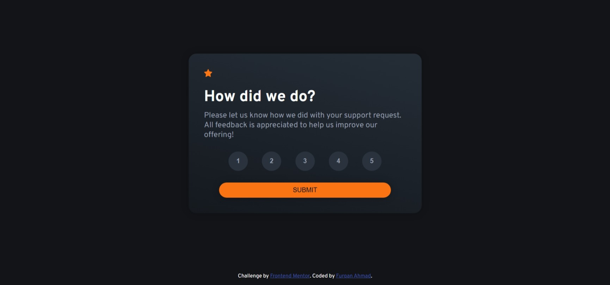

# Frontend Mentor - Interactive rating component solution

This is a solution to the [Interactive rating component challenge on Frontend Mentor](https://www.frontendmentor.io/challenges/interactive-rating-component-koxpeBUmI). Frontend Mentor challenges help you improve your coding skills by building realistic projects. 

## Table of contents

- [Overview](#overview)
  - [The challenge](#the-challenge)
  - [Screenshot](#screenshot)
  - [Links](#links)
- [My process](#my-process)
  - [Built with](#built-with)
  - [What I learned](#what-i-learned)
  - [Continued development](#continued-development)
  - [AI Collaboration](#ai-collaboration)
- [Author](#author)

**Note: Delete this note and update the table of contents based on what sections you keep.**

## Overview

### The challenge

Users should be able to:

- View the optimal layout for the app depending on their device's screen size
- See hover states for all interactive elements on the page
- Select and submit a number rating
- See the "Thank you" card state after submitting a rating

### Screenshot

### Links

- Solution URL: [Solution URL here](https://github.com/furqan7m3-ops/interactive-rating-component-main.git)
- Live Site URL: [Live site URL here](https://interactive-rating-component-main-xi-mocha.vercel.app/)

### Built with

- Semantic HTML5 markup
- CSS custom properties
- Flexbox
- CSS Grid
- Javascript

### What I learned
I learnt about a very powerful selector named :not(). This is very helpful when defining active states. Sometimes the hover state and active states conflict with each other. This is very helpful is resolving such power. Here's a snippet that helped resolve the conflict:
`

.rating > button:not(.active):hover{
    background: var(--rating-btn-hover);
    color: var(--text-color-dark);
}
`
This code snippet means that when a button is not active then apply properties in hover state. This eventually solves the conflict.
### Continued development
This project is still work in progress. There are some issues related to mobile layout.
### AI Collaboration
Used Claude AI for structuring the HTML. I asked where to use what semantic tag.
## Author
- Frontend Mentor - [@furqan7m3-ops](https://www.frontendmentor.io/profile/furqan7m3-ops)